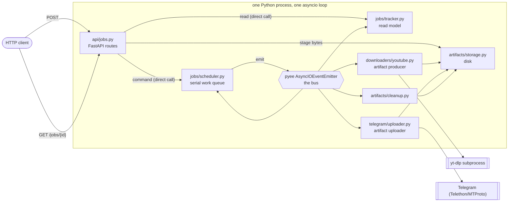
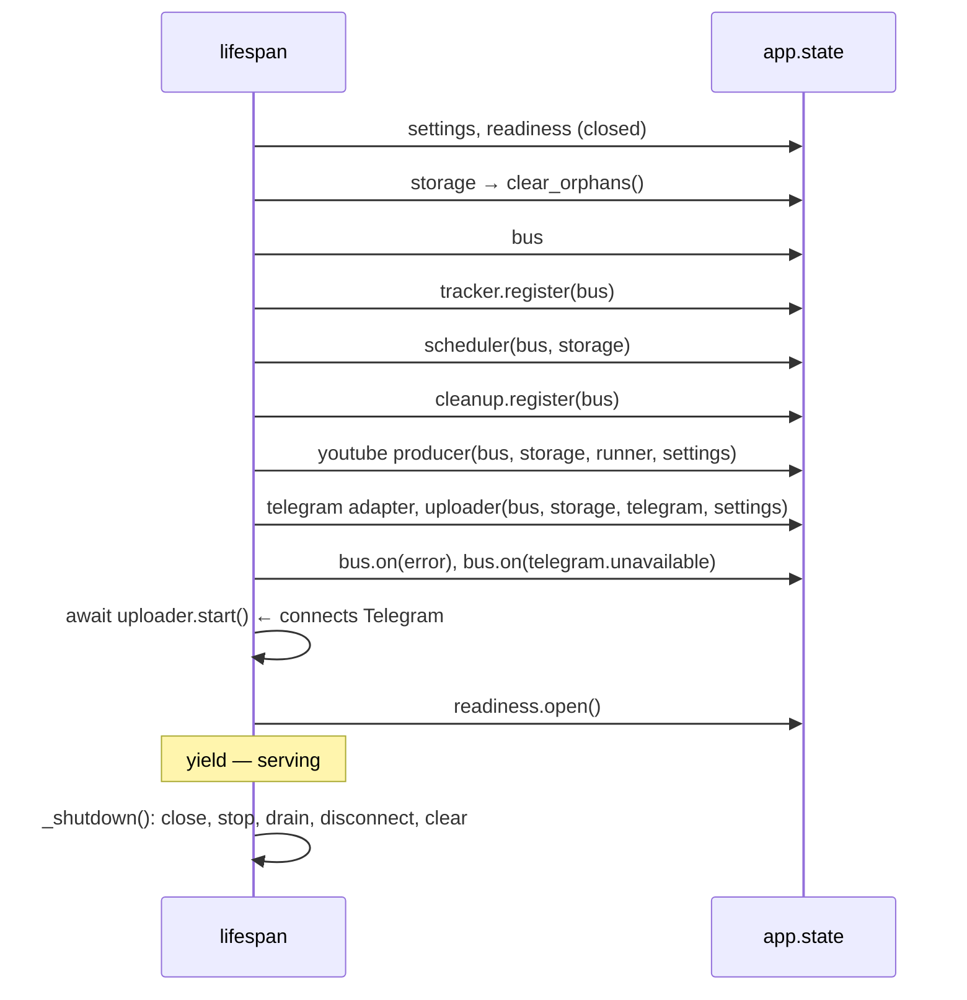

# Architecture

`anything2telegram` is a single-process, event-driven HTTP server. You POST a YouTube URL or a
file; it produces a media file on local disk and uploads it to one private Telegram channel over
MTProto. Everything between the HTTP request and the Telegram message happens as facts published
on one in-process event bus.

The purpose of the design is stated in [MISSION.md](../MISSION.md): learn pyee's
`AsyncIOEventEmitter` and the Observer / publish–subscribe pattern by building something real.
That is why the bus is explicit and central rather than hidden behind a framework.

---

## 1. Shape of the system



Two directions of travel, and the distinction is the core of the design:

- **Commands travel by direct call.** The API calls `scheduler.submit_video(...)` and gets a job id
  back synchronously, because HTTP needs an answer in the same request.
- **Facts travel on the bus.** Nothing calls the producer or the uploader. They subscribe. The
  scheduler announces `youtube.download.requested`; whoever cares reacts.

There is no orchestrator object that knows the whole pipeline. The pipeline is *choreographed* —
each component knows only which facts it consumes and which it produces.

---

## 2. Files

| File | Lines | Responsibility |
|---|---:|---|
| [main.py](../anything2telegram/main.py) | 118 | Wiring. Builds every component in the FastAPI lifespan, connects them to one bus, owns readiness and shutdown drain. |
| [config.py](../anything2telegram/config.py) | 140 | `Settings` frozen dataclass, parsed from `.env` + environment. Fails loudly at startup on bad config. |
| [domain.py](../anything2telegram/domain.py) | 118 | Vocabulary: enums, refs, snapshots, `StagedArtifact`, `UploadReservation`. Pure data, zero behaviour. |
| [events.py](../anything2telegram/events.py) | 133 | The 14 topic-name constants and one frozen dataclass per event. The contract between components. |
| [api/jobs.py](../anything2telegram/api/jobs.py) | 322 | HTTP surface. Validates input, translates exceptions to status codes, renders snapshots to JSON. |
| [jobs/scheduler.py](../anything2telegram/jobs/scheduler.py) | 386 | The only stateful decision-maker: one work item active at a time, queue of the rest. |
| [jobs/tracker.py](../anything2telegram/jobs/tracker.py) | 344 | Read model. Folds lifecycle facts into in-memory job/batch records for `GET /jobs/{id}`. |
| [downloaders/youtube.py](../anything2telegram/downloaders/youtube.py) | 403 | URL classification (pure functions) + the producer that drives yt-dlp and announces artifacts. |
| [downloaders/process.py](../anything2telegram/downloaders/process.py) | 155 | Subprocess mechanics: own process group, bounded output capture, SIGTERM→SIGKILL on timeout. |
| [telegram/client.py](../anything2telegram/telegram/client.py) | 107 | Telethon adapter. Maps every Telethon failure onto three of our own exceptions. |
| [telegram/uploader.py](../anything2telegram/telegram/uploader.py) | 295 | Bus handler for `artifact.ready`: revalidates, uploads, announces the outcome. |
| [artifacts/storage.py](../anything2telegram/artifacts/storage.py) | 149 | Disk layout `root/<job_id>/<artifact_id>/<filename>`, streaming staging, deletion. |
| [artifacts/cleanup.py](../anything2telegram/artifacts/cleanup.py) | 28 | Deletes a job's directory when the job reaches any terminal fact. |

**Dependency direction.** `domain.py` imports nothing of ours. `events.py` imports only `domain`.
Everything else imports inward toward those two and never sideways into a peer's internals — the
scheduler does not import the uploader, the uploader does not import the producer. The bus is the
only thing they share, and it is passed in, not imported as a global.

---

## 3. The bus

The bus is a plain `pyee.asyncio.AsyncIOEventEmitter`, created in `main.py`'s lifespan. There is no
wrapper class and no `EventBus` interface — components take `bus` as a constructor argument and use
two methods: `bus.on(topic, handler)` and `bus.emit(topic, event)`.

Runtime mechanics worth knowing before changing any handler:

- **Sync handlers run inline, during `emit()`, in subscription order.** By the time `emit()` returns,
  every sync listener has finished. A sync listener that raises propagates out of `emit()` into the
  caller.
- **Async handlers do not.** pyee wraps the returned coroutine in a task, so `emit()` returns while
  the handler is still at its first `await`. Async work is therefore always concurrent with whatever
  the emitter does next.
- **An async handler that raises re-emits on the `error` topic** instead of vanishing. That is how a
  producer or uploader crash becomes visible to `main.py`.
- **`bus.complete` / `bus.wait_for_complete()`** expose whether any handler task is still running.
  Shutdown uses them to drain.

Subscription order is set by the wiring order in `main.py` and is load-bearing:

| Topic | Listeners, in dispatch order |
|---|---|
| `batch.created` | tracker |
| `job.queued` | tracker |
| `job.started` | tracker |
| `batch.jobs.created` | tracker |
| `youtube.playlist.expansion.requested` | producer *(async)* |
| `youtube.playlist.expanded` | scheduler |
| `youtube.playlist.expansion.failed` | tracker, scheduler |
| `youtube.download.requested` | producer *(async)* |
| `artifact.ready` | tracker, scheduler, uploader *(async)* |
| `artifact.production.failed` | tracker, scheduler, cleanup |
| `artifact.uploaded` | tracker, scheduler, cleanup |
| `artifact.upload.failed` | tracker, scheduler, cleanup |
| `telegram.unavailable` | scheduler (pause), readiness (close) |
| `error` | `main.on_event_error` |

The tracker is registered first everywhere on purpose: the read model is updated before the
scheduler is allowed to advance the queue, so a status read can never observe a job that the
scheduler has already moved past. Cleanup is registered after the scheduler for the same reason —
files are deleted only after every in-process reader has seen the terminal fact.

### Event catalogue

| Topic | Emitted by | Means |
|---|---|---|
| `batch.created` | scheduler | A playlist submission was accepted; expansion not started. |
| `job.queued` | scheduler | A job exists and is waiting. Carries `staged_artifact` for local uploads. |
| `job.started` | scheduler | This job is now the active one, in phase `producing` or `uploading`. |
| `youtube.playlist.expansion.requested` | scheduler | Someone should list this playlist. |
| `youtube.playlist.expanded` | producer | Playlist listed: N download targets, M entries skipped. |
| `youtube.playlist.expansion.failed` | producer | Playlist could not be listed; the batch is dead. |
| `batch.jobs.created` | scheduler | The batch's final child job ids, in order. |
| `youtube.download.requested` | scheduler | Someone should download this video. |
| `artifact.ready` | producer, scheduler | A file exists on disk and is ready to upload. |
| `artifact.production.failed` | producer | No file will appear for this job. |
| `artifact.uploaded` | uploader | The file is in the channel, with a message id. |
| `artifact.upload.failed` | uploader, scheduler | The file will not reach the channel. |
| `telegram.unavailable` | uploader | Telegram is gone; stop taking work. |
| `error` | uploader, pyee | A handler blew up in a way nobody handled. |

Every event is a frozen dataclass named in the past tense, carrying its own `occurred_at`. Events
are facts, not requests — the two `*.requested` topics are the deliberate exception, and they read
as "a request was made", not "please do this now".

---

## 4. The scheduler: one thing at a time

`JobScheduler` is the only component with meaningful mutable state:

```
_queue      deque of work items    (_YouTubeWork | _PlaylistWork | _StagedWork)
_active     the one item in flight, or None
_active_phase / _active_artifact_id   what the active item is currently doing
_reservations   uploads whose bytes are still arriving over HTTP
_paused / _stopped                    admission control
```

Serialization is the whole point: one download and one upload at a time, so a playlist of 200
videos cannot exhaust disk or saturate the uplink.

The loop never runs as a loop. `_request_pump()` schedules `_pump` via
`asyncio.get_running_loop().call_soon(...)` and sets a flag so re-entrant requests collapse into one
tick. `_pump` takes at most one item, marks it active, and emits the fact that starts it. Advancing
only happens when a terminal fact for the active item arrives — `_on_job_terminal` clears `_active`
and requests the next pump.

`_emit()` is the one piece of subtlety, and it exists because sync listeners run inline:

```python
def _emit(self, topic: str, event: object) -> None:
    """Publish a fact, then surface a scheduler failure a handler caused."""
    try:
        self._bus.emit(topic, event)
    except Exception:
        self.fail()
        raise
    if self._stopped:
        raise _unavailable()
```

A sync listener can reject the fact (the tracker refuses an illegal transition) or can shut the
scheduler down mid-emit. Both must stop the caller instead of leaving a half-announced job.

Admission control has three levels:

- `pause()` — reversible, triggered by `telegram.unavailable`. Stops pumping and stops accepting.
- `stop()` — shutdown. Drops queued local uploads and deletes their files.
- `fail()` — a handler crashed. Same as `stop()`, plus it drops the active upload's files.

`accepting` is `not (paused or stopped)` and is read by `/health` and by every POST.

---

## 5. The tracker: a read model, not a database

The tracker owns no lifecycle decisions. It subscribes to the lifecycle facts and folds them into
`_JobRecord` / `_BatchRecord` dicts, and `GET /jobs/{id}` renders a `JobSnapshot` from them. It is
CQRS with the write side in the scheduler and the read side here, minus any persistence — restart
the process and all history is gone, which is correct for a personal single-process tool.

It is also the system's transition validator. It rejects duplicate ids, unknown ids, illegal
transitions (`InvalidJobTransition`), and conflicting terminal events. Because it is a sync listener
registered first, that rejection propagates out of `emit()` and back into the scheduler's `_emit`,
which fails the scheduler. An inconsistent projection is treated as a bug that stops the app, not as
something to log and continue past.

Batch status is *derived*, never stored: `_derive_batch_status` counts child job statuses at read
time. `partially_completed` means some children failed or some playlist entries were skipped.

---

## 6. Storage and the local-upload reservation

Layout is `artifact_root/<job_id>/<artifact_id>/<filename>`. Directories are `0o700`, files `0o600`.
Deleting a job is `shutil.rmtree` of its directory, which is why the job id is the top level.

Local uploads use a two-step reservation because the bytes arrive over HTTP, slowly, and the job
must not become visible until they are all there:

1. `scheduler.reserve_local_upload(...)` → `storage.reserve(...)` sanitizes the filename, creates the
   directory, checks for collision, and returns an `UploadReservation`. No event yet — nothing is
   observable.
2. `storage.stage(...)` streams the body to the destination in 64 KB chunks, aborting on oversize,
   `ENOSPC`, or client disconnect, and deleting the whole job directory on any failure.
3. `scheduler.enqueue_reserved_upload(...)` revalidates the file on disk, then emits `job.queued`.
   Now the job exists.

Every path that abandons a reservation deletes its directory, so a failed upload cannot leak bytes.
`clear_orphans()` runs at both startup and shutdown and empties the root — which is exactly why
`config.py` refuses an `ARTIFACT_ROOT` that is a filesystem root or the project directory.

---

## 7. External boundaries

Two things in this system can fail in ways we don't control, and each gets exactly one adapter.

**yt-dlp** — `YouTubeProcessRunner` starts it with `start_new_session=True` so the whole process
tree (yt-dlp plus its ffmpeg children) is one process group that a timeout can kill with `killpg`,
SIGTERM then SIGKILL after a grace period. stdout is captured up to 1 MB; stderr is *counted, not
kept*, and surfaces as `"process stderr suppressed (N bytes)"` — yt-dlp errors can contain cookies
and URLs, so they never enter an event or an HTTP response.

Above that, `YouTubeArtifactProducer` polls the download directory once a second while yt-dlp runs
and aborts if the partial download outgrows `max_artifact_bytes`. `--max-filesize` alone is not
enough, because yt-dlp only knows a size it was told in advance.

**Telegram** — `TelegramClientAdapter` collapses Telethon's error surface into
`TelegramUnavailableError` / `TelegramUploadError` / `TelegramClientError`, so no `telethon` symbol
appears above it. Uploads go `upload_file(part_size_kb=512)` then `send_file(handle)`: two calls
instead of one, because `send_file` cannot forward the part size, and 512 KB parts mean ~4× fewer
RPCs on a 2 GB file.

Nothing else in the codebase has an adapter or an interface. `ArtifactStorage` is called directly,
`JobTracker` is called directly, the bus is passed as an argument. A port with one implementation is
a layer with no purpose.

---

## 8. Wiring, readiness, shutdown

`create_app()` installs a lifespan that builds everything in dependency order and hangs it on
`app.state` — Starlette's own per-app container. Routes reach it via `request.app.state`, which is
the framework's native dependency injection; there is no injection machinery of our own.



`await uploader.start()` is the gate. Telegram connects *before* readiness opens, and a failure there
runs `_shutdown` and re-raises, so the process refuses to serve rather than accepting jobs it cannot
finish.

`Readiness` is a one-field flag guarding admission. It closes on `telegram.unavailable`, on `error`,
and at shutdown. `/health` reports `ready and telegram.is_connected and scheduler.accepting`, and
every POST checks the same predicate — the system fails closed.

Shutdown is ordered so nothing is lost silently:

1. `readiness.close()` — no new HTTP work.
2. `scheduler.stop()` — no new bus work; queued uploads' files deleted.
3. `uploader.begin_shutdown()` — refuse new artifacts, let in-flight uploads run.
4. `_drain_bus(...)` — wait for handler tasks up to `shutdown_grace_seconds`, then `bus.cancel()`.
   The wait re-checks in a loop because a draining handler can emit again.
5. `uploader.stop(disconnect=False)`, `clear_orphans()`, `telegram.disconnect()`.

---

## 9. What the parts follow

| Part | Pattern / principle it follows |
|---|---|
| the bus | Observer, publish–subscribe. Emitters know topics, not subscribers. |
| the pipeline as a whole | Choreography, not orchestration. No component knows the full flow. |
| `events.py` | Events are immutable past-tense facts with their own timestamp. |
| scheduler | Single writer, serial queue. Exactly one item active; advance only on a terminal fact. |
| tracker | Read model / projection (CQRS-lite). Derives status, stores no decisions. |
| `domain.py` | Anaemic data by design — vocabulary shared by every layer, so it owns no rules. |
| `client.py`, `process.py` | Adapter at a real external boundary; translate foreign failures into ours. |
| `api/jobs.py` | Thin edge: validate, delegate, translate errors to status codes. No business logic. |
| `main.py` | Composition root. The single place that knows concrete types. |
| `app.state` | Use the platform's DI. No custom container, no factories, no protocols. |
| readiness | Fail closed. Degrade to refusing work rather than accepting and dropping it. |
| `cleanup.py` | Cleanup driven by a terminal fact, not by a lexical scope. |
| errors | Stable `{code, message}` pairs; internal detail (stderr, tracebacks) never crosses the boundary. |
| tests | No production code exists to serve a test. Tests monkeypatch module attributes at the two real seams — `YouTubeProcessRunner` and `TelegramClientAdapter`. |

The last row is the deliberate constraint behind the current shape. Earlier revisions carried an
`AdapterFactories` dataclass, nine injectable factories, fourteen single-implementation `Protocol`
classes, `clock`/`logger`/`id_factory` parameters, and proxy objects wrapping `app.state` — all of it
existing only so tests could substitute. It was removed. What replaced it is `monkeypatch.setattr`
on two module attributes in [tests/conftest.py](../tests/conftest.py).

---

## 10. Known limits

Deliberate, with the upgrade path if they ever bite:

- **In-memory only.** Restart loses all job history. Add persistence when a restart mid-batch
  becomes a real problem.
- **One job at a time.** Simple and safe on a home connection; a concurrency knob is a queue change,
  not an architecture change.
- **One process.** The bus is in-process, so the whole design assumes one worker. Multiple workers
  would need a real broker — explicitly out of scope per MISSION.md.
- **Unavailable playlist entries are not filtered.** They become jobs that fail visibly, so
  member-only videos still work through cookies. Marked with a `ponytail:` comment in
  `_parse_playlist`.
- **Config is read once at startup.** No reload; restart to change settings.
