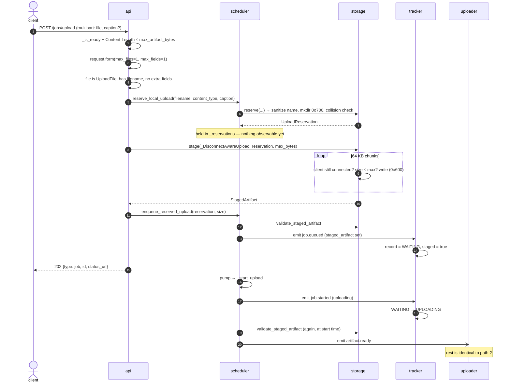
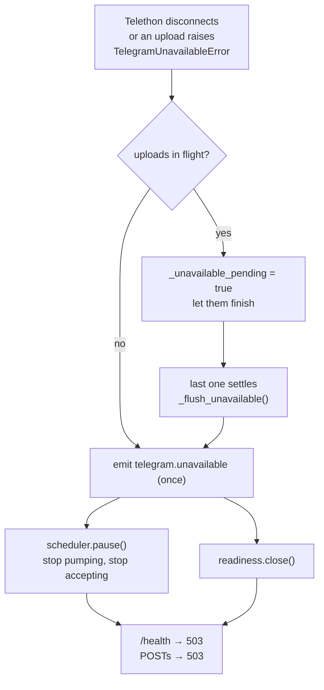

# Happy paths

Six paths cover everything the system does. Each section gives the sequence of events, the rules that
path obeys, and the ways it can leave the happy path.

Read [ARCHITECTURE.md](ARCHITECTURE.md) first for the bus mechanics — in particular that **sync
listeners run inline inside `emit()` in subscription order**, while **async listeners become tasks**.
Every diagram below depends on that distinction.

Cast, in wiring order: `tracker` → `scheduler` → `cleanup` → `producer` → `uploader`.

Arrow convention in the diagrams below: `──▶` (solid) is a **sync** listener running inline inside
`emit()`; `--▶` (open) is an **async** listener that pyee turns into a task, so the emitter continues
immediately.

---

## 1. Startup

```
Settings.from_env()          .env + os.environ, env wins; ConfigError aborts the process
ArtifactStorage(root)        mkdir 0o700
storage.clear_orphans()      empty the root — last run's leftovers are worthless
AsyncIOEventEmitter()        the bus
tracker.register(bus)        read model subscribes first
JobScheduler(bus, storage)   queue subscribes second
cleanup.register(bus)        deleter subscribes third
YouTubeArtifactProducer(...)
TelegramClientAdapter(...) + TelegramArtifactUploader(...)
bus.on(error), bus.on(telegram.unavailable)
await uploader.start()       ← connects to Telegram; failure aborts startup
readiness.open()             ← only now does the API accept anything
```

**Follows:** fail closed (readiness opens last), fail fast (bad config or unreachable Telegram never
reaches the serving state), and subscribe-before-emit (every listener is attached before any fact can
be published).

**Leaves the path when:** config is missing/invalid/unsafe (`ConfigError`, process exits), or
Telegram will not connect (`_shutdown()` runs, exception re-raised, process exits).

---

## 2. Single YouTube video

```mermaid
sequenceDiagram
    autonumber
    actor C as client
    participant A as api
    participant S as scheduler
    participant T as tracker
    participant P as producer
    participant Y as yt-dlp
    participant U as uploader
    participant TG as Telegram
    participant CL as cleanup

    C->>A: POST /jobs/youtube {url}
    A->>A: classify_youtube_url → VIDEO
    A->>A: _is_ready(request)
    A->>S: submit_video(url)
    S->>S: queue.append(_YouTubeWork)
    S->>T: emit job.queued
    T->>T: record = WAITING
    S->>S: call_soon(_pump)
    A-->>C: 202 {type: job, id, status_url}

    Note over S: next loop tick
    S->>S: _pump → _active = work
    S->>T: emit job.started (producing)
    T->>T: WAITING → PRODUCING
    S-)P: emit youtube.download.requested
    Note over P: async handler → task

    P->>P: allocate_download_directory(job, artifact)
    P->>Y: yt-dlp -f <best ≤1080p streams within N> --max-filesize N
    loop every 1s while running
        P->>P: download_directory_size ≤ 3 × max_artifact_bytes?
    end
    Y-->>P: exit 0
    P->>P: _discover_artifact → exactly one .mp4/.mkv/.webm
    P->>T: emit artifact.ready
    T->>T: PRODUCING → UPLOADING (artifact_id, filename, size)
    P->>S: (same emit) scheduler phase → UPLOADING
    P-)U: (same emit) async handler → task

    U->>U: dedupe (job_id, artifact_id); _validate on disk
    U->>TG: upload_file(512 KB parts) → send_file(handle)
    TG-->>U: message
    U->>T: emit artifact.uploaded
    T->>T: UPLOADING → COMPLETED (+ telegram_message_id)
    U->>S: (same emit) clear active → call_soon(_pump)
    U->>CL: (same emit) rmtree(root/<job_id>)

    C->>A: GET /jobs/{id}
    A-->>C: 200 status=completed, telegram_message_id
```

**Follows:**

- The HTTP response commits to nothing but a queue position. Work starts on a later loop tick, so a
  slow download cannot hold the request open.
- One `emit` fans out to three listeners in a fixed order — projection, then queue, then side
  effects. The read model is always at least as current as the scheduler.
- The uploader re-validates the file it was told about (`lstat`, regular file, inside the storage
  root, size matches, size ≤ limit). The event is a claim; disk is the truth.
- The upload is idempotent per `(job_id, artifact_id)`. A replayed `artifact.ready` is dropped.
- Files are deleted by the terminal fact, so cleanup happens identically on success and on failure.

**Leaves the path when:**

| Where | Fact / response |
|---|---|
| URL not a supported YouTube URL | `422 unsupported_youtube_url` |
| not ready (Telegram down, shutting down) | `503 service_unavailable` |
| yt-dlp exits non-zero | `artifact.production.failed` — `youtube_process_failed` |
| yt-dlp exceeds `YTDLP_TIMEOUT_SECONDS` | process group killed, `youtube_timeout` |
| download scratch space outgrows 3× the artifact limit | yt-dlp cancelled, `artifact_oversize` |
| output missing or ambiguous | `internal_error` |
| Telegram upload times out | `artifact.upload.failed` — `telegram_timeout` |
| Telegram connection lost | `telegram_unavailable` + `telegram.unavailable` → scheduler pauses |

Every one of those ends in a terminal fact, so the tracker records a `failed` job, the cleanup
deletes the files, and the scheduler moves on. Failure is a first-class path, not an exception leak.

---

## 3. YouTube playlist (batch)

```mermaid
sequenceDiagram
    autonumber
    actor C as client
    participant A as api
    participant S as scheduler
    participant T as tracker
    participant P as producer

    C->>A: POST /jobs/youtube {url: playlist, offset}
    A->>S: submit_playlist(url, offset)
    S->>S: queue.append(_PlaylistWork)
    S->>T: emit batch.created
    T->>T: batch = EXPANDING
    A-->>C: 202 {type: batch, id, /batches/{id}}

    S->>S: _pump → _active = playlist
    S-)P: emit youtube.playlist.expansion.requested
    P->>P: yt-dlp --flat-playlist --dump-json --playlist-start offset+1
    P->>P: _parse_playlist → dedupe by video id, count skipped
    P->>S: emit youtube.playlist.expanded (targets, skipped)

    S->>S: child _YouTubeWork per target, queue.extendleft(...)
    S->>S: _clear_active()
    loop per child
        S->>T: emit job.queued (batch_id set)
    end
    S->>T: emit batch.jobs.created (job_ids, skipped_entries)
    T->>T: batch job_ids fixed; status now derived
    S->>S: call_soon(_pump) → each child runs path 2
```

**Follows:**

- Expansion is itself a queued work item. Listing a playlist runs yt-dlp, so it takes a turn like
  everything else instead of running concurrently with a download.
- Children go to the **front** of the queue (`extendleft`), so a batch finishes before work submitted
  after it. A playlist is one unit of intent.
- Dedupe happens exactly once, in `_parse_playlist`. The `skipped_entries` count travels with the
  fact, so the scheduler never recounts and the tracker never guesses.
- `job.queued` for every child is emitted **before** `batch.jobs.created`. The tracker enforces this:
  `batch.jobs.created` must match the ids it already saw queued, or it raises. The batch's job list
  can never name a job that does not exist.
- Batch status is derived at read time from child statuses — `expanding` → `waiting` → `processing` →
  `completed` / `partially_completed` / `failed`. `partially_completed` is the honest answer when some
  children failed or some entries were skipped.

**Leaves the path when:** yt-dlp fails or times out listing (`youtube_process_failed` /
`youtube_timeout`), the JSON will not parse (`playlist_parse_failed`), or nothing downloadable is
left (`playlist_empty`). All four emit `youtube.playlist.expansion.failed`, the batch becomes
`failed` with no children, and the scheduler advances.

---

## 4. Local file upload



**Follows:**

- Two-phase admission. A reservation is invisible; only `enqueue_reserved_upload` publishes
  `job.queued`. A half-received upload never appears as a job.
- Every abandonment path deletes the job directory — storage error, scheduler error, client
  disconnect, unexpected exception, and `scheduler.stop()` at shutdown. Bytes cannot leak.
- Size is enforced twice, on purpose: `Content-Length` rejects a declared oversize before a byte is
  read, and the streaming writer rejects an actual oversize regardless of what the header claimed.
- Filenames are sanitized to `[A-Za-z0-9._-]`, so `../../etc/passwd` becomes `.._.._etc_passwd`.
  Traversal is neutralized, not merely rejected.
- A staged upload skips the producing phase entirely: `job.started(uploading)` then `artifact.ready`
  straight from the scheduler. The tracker knows a staged job's first phase must be `uploading` and
  rejects `producing`.
- `form.close()` always runs, so `SpooledTemporaryFile` handles never leak.

**Leaves the path when:**

| Where | Response |
|---|---|
| not ready | `503 service_unavailable` |
| `Content-Length` over the limit | `413 staging_oversize` |
| malformed multipart, missing/extra fields, no filename | `422 invalid_request` |
| filename sanitizes to nothing | `422 invalid_filename` |
| body exceeds the limit while streaming | `413 staging_oversize` |
| disk full | `507 staging_disk_full` |
| other write failure | `500 upload_staging_failed` |
| client vanishes mid-upload | `ClientDisconnect` propagates; job directory deleted |
| file missing/changed at start time | `artifact.upload.failed` — `artifact_invalid` |

---

## 5. Reading status

```
GET /jobs/{id}      → tracker.get_job(UUID)   → 200 JobSnapshot   | 404 job_not_found
GET /batches/{id}   → tracker.get_batch(UUID) → 200 BatchSnapshot | 404 batch_not_found
GET /health         → 200 {ready: true,  telegram_connected: true}
                    | 503 {ready: false, telegram_connected: …}
```

**Follows:** reads never touch the bus, the queue, or the disk — a status poll cannot perturb
processing. A malformed UUID is a 404, not a 422: a caller cannot distinguish "no such job" from
"not a job id", so neither can the response. `/health` is the conjunction of all three admission
conditions (`readiness`, `telegram.is_connected`, `scheduler.accepting`), which is exactly the
predicate every POST uses.

---

## 6. Shutdown

```mermaid
sequenceDiagram
    autonumber
    participant L as lifespan
    participant R as readiness
    participant S as scheduler
    participant U as uploader
    participant B as bus
    participant ST as storage
    participant TG as telegram

    L->>R: close()                      no new HTTP work
    L->>S: stop()                       no new bus work; queued uploads' files deleted
    L->>U: begin_shutdown()             refuse new artifacts, keep in-flight ones
    L->>B: _drain_bus(grace_seconds)
    loop until bus.complete
        B-->>L: wait_for_complete()     a draining handler may emit again
    end
    Note over B: on timeout → bus.cancel()
    L->>U: stop(disconnect=False)
    L->>ST: clear_orphans()
    L->>TG: disconnect()
```

**Follows:** stop admitting before draining, then drain before tearing down. The drain loop re-checks
`bus.complete` because a finishing handler can publish another fact. `shutdown_grace_seconds` bounds
it; past that, tasks are cancelled rather than the process hanging. The uploader's in-flight upload is
given the grace window to complete and announce `artifact.uploaded` — so a file already on its way to
Telegram is not thrown away on Ctrl-C.

---

## 7. Degradation: losing Telegram mid-flight

Not a happy path, but the one that shapes the others.



The pause signal is deliberately deferred until in-flight uploads settle, so a disconnect noticed
mid-upload does not pre-empt an upload that might still succeed. `telegram.unavailable` is emitted at
most once per process.

There is no automatic recovery — a paused scheduler stays paused until restart. The queued work is
still visible through `GET /jobs/{id}` as `waiting`, so nothing is silently lost; it simply will not
proceed. Reconnect-and-resume is the obvious next feature and is deliberately absent.

The `error` topic is the same story for programmer error: any async handler that raises re-emits
there, and `main.on_event_error` logs it, closes readiness, and calls `scheduler.fail()`. A bug
degrades the process to refusing work rather than half-processing it.

---

## What every path has in common

1. **Accept fast, work later.** HTTP returns a queue position; the work starts on a subsequent loop
   tick.
2. **One thing at a time.** Exactly one work item is active, and only a terminal fact advances the
   queue.
3. **Facts, not commands.** Components announce what happened. Nobody calls the next stage.
4. **Trust disk, not events.** Every consumer of a path re-validates the file it was handed.
5. **Every path terminates.** Success and every failure end in a terminal fact, which is what updates
   the read model, releases the queue, and deletes the files.
6. **Fail closed.** Any doubt about Telegram or about our own handlers closes admission instead of
   accepting work that cannot finish.
