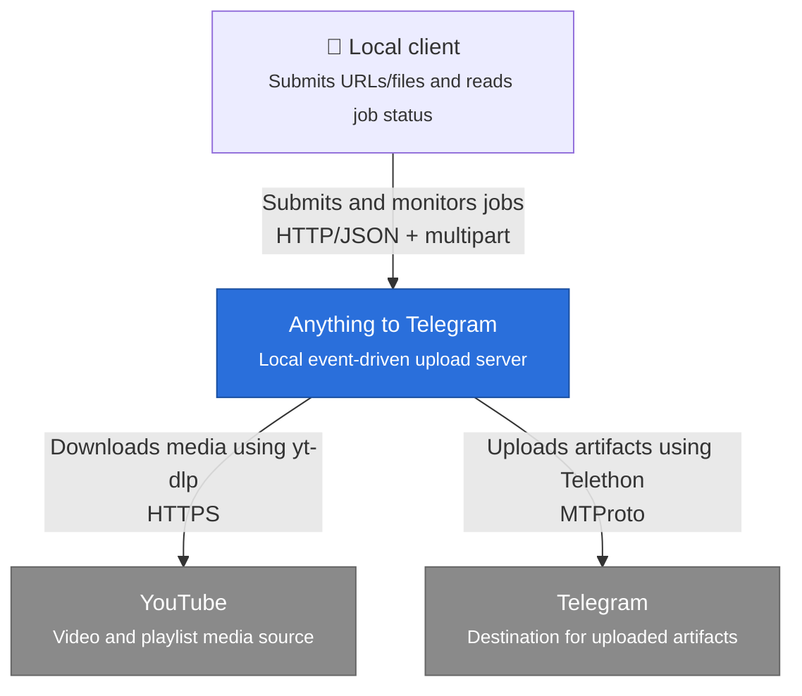
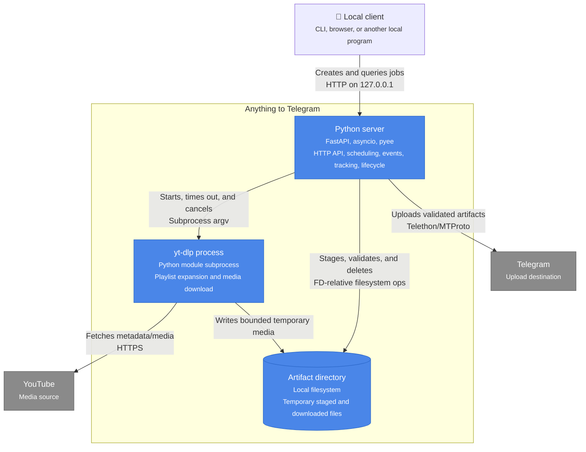
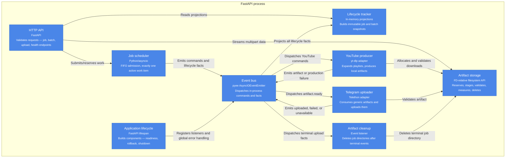
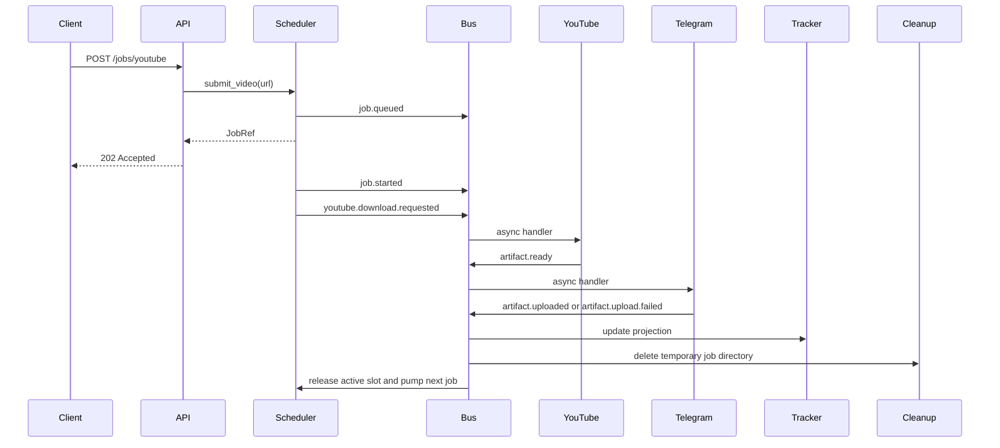

# Current Architecture

## Scope

- Local Python server accepting YouTube URLs and multipart file uploads.
- Files become local artifacts before Telegram upload.
- Modules communicate through typed `pyee` events.
- One active work item at a time; remaining work waits in memory.
- No authentication, durable queue, retry, crash recovery, or multi-process coordination.

## System context

## Container view

## Component view

## Event choreography

### YouTube video

### Playlist

- Playlist submission creates a batch and occupies the active scheduler slot during expansion.
- YouTube emits ordered targets plus skipped-entry count.
- Scheduler deduplicates targets, creates one child job per target, and inserts children at queue front.
- Later standalone submissions wait until playlist children finish.
- Batch status derives from child projections: completed, failed, or partially completed.

### Direct upload

- API reserves job/artifact IDs and a safe destination.
- Multipart bytes are bounded during parsing, then streamed into artifact storage.
- Scheduler queues the staged artifact only after staging succeeds.
- When its FIFO turn arrives, scheduler emits `artifact.ready`; Telegram remains source-agnostic.

## Event contracts

Commands:

- `youtube.playlist.expansion.requested`
- `youtube.download.requested`

Facts:

- `batch.created`
- `batch.jobs.created`
- `job.queued`
- `job.started`
- `youtube.playlist.expanded`
- `youtube.playlist.expansion.failed`
- `artifact.ready`
- `artifact.production.failed`
- `artifact.uploaded`
- `artifact.upload.failed`
- `telegram.unavailable`

All event payloads are frozen domain objects with timezone-aware timestamps. Producers and consumers depend only on shared contracts, not on each other.

## Runtime and lifecycle

Startup order:

1. Load settings from the application base directory.
2. Validate/claim artifact storage and clear startup orphans.
3. Create one event bus and register global/error listeners.
4. Register tracker, scheduler, cleanup, YouTube, and Telegram components.
5. Connect Telegram and start its disconnect monitor.
6. Open readiness and accept submissions.

Shutdown order:

1. Close readiness and scheduler admission.
2. Stop accepting new Telegram artifacts.
3. Drain active event tasks within configured grace.
4. Cancel remaining work and await cleanup.
5. Stop uploader/monitor.
6. Clear artifact directories best-effort.
7. Disconnect Telegram last.

## Failure boundaries

- Scheduler owns queue state; tracker only observes facts.
- Listener/programming failures mark scheduler fatal and readiness false.
- Telegram disconnection fails the current upload, emits `telegram.unavailable`, pauses scheduling, and rejects new submissions.
- yt-dlp runs in its own process group; timeout/cancellation sends terminate, then kill if still alive.
- Known and unknown YouTube sizes are bounded using `--max-filesize` plus FD-relative directory-size monitoring.
- Terminal upload events trigger idempotent artifact cleanup.
- All queues, projections, dedupe registries, and events are process-local and non-durable.

## HTTP surface

- `POST /jobs/youtube`
- `POST /jobs/upload`
- `GET /jobs/{job_id}`
- `GET /batches/{batch_id}`
- `GET /health`

The intended launch target is `anything2telegram.main:app`, bound locally to `127.0.0.1`.
